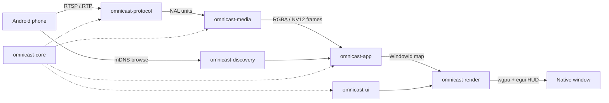

# omnicast-rs

[](LICENSE)
[](https://www.rust-lang.org/)
[](ROADMAP.md)
[](#current-status)

**omnicast-rs** is a high-performance, open-source Android screen-casting **desktop receiver** written in Rust. It advertises itself on the local network, accepts streaming sessions, and renders each phone into its own native, resizable GPU-backed window.

## Current Status

| | |
|---|---|
| **Version** | `v0.1.0-alpha` (git tag) |
| **Phase** | Milestone 1 shell + live RTSP handshake + telemetry HUD |
| **Platforms** | Windows-first (Linux / macOS architecture-ready) |
| **Cast path** | mDNS + RTSP/RTP foundations; full Cast V2 / Miracast planned |

**Done today:** workspace crates, `winit`/`wgpu` multi-window render, mDNS as **OmniCast**, live RTSP handshake with packet logging, mock 60 FPS demo, `egui` HUD (FPS / bitrate / uptime) and settings modal.

**Next up:** hardware H.264 decode, multi-device session isolation, Miracast / Cast V2 adapters — see [ROADMAP.md](ROADMAP.md).

---

## Crate architecture



| Crate | Role |
|-------|------|
| `omnicast-app` | Binary (`omnicast-app` / `omnicast`): `winit` `ApplicationHandler`, session → window map |
| `omnicast-core` | `DeviceId`, sessions, `AppEvent`, thread-safe `StreamMetrics` / `MetricsRegistry` |
| `omnicast-discovery` | mDNS / DNS-SD advertisement (`_rtsp._tcp`, `_display._tcp`, `_googlecast._tcp`) |
| `omnicast-protocol` | Tokio RTSP server, RTP parse, H.264 NAL extraction, session logging |
| `omnicast-media` | Decode pipeline stub + mock RGBA frame generator |
| `omnicast-render` | `wgpu` blit pipeline + `egui-wgpu` overlay host |
| `omnicast-ui` | HUD telemetry bar + settings panel (immediate-mode `egui`) |

```
crates/
  omnicast-app/          # binary entry
  omnicast-core/         # shared types + metrics
  omnicast-discovery/    # mDNS
  omnicast-protocol/     # RTSP / RTP
  omnicast-media/        # decode / mock frames
  omnicast-render/       # wgpu + egui overlay
  omnicast-ui/           # HUD + settings widgets
```

---

## UI features (telemetry & settings)

Landed in `v0.1.0-alpha`:

| Feature | Details |
|---------|---------|
| **HUD telemetry bar** | Translucent top bar over the video surface (`egui` / `egui-wgpu`) |
| **Live FPS** | Rolling 1-second window via `StreamMetrics` |
| **Bitrate** | Incoming throughput (Kbps / Mbps) from network samples |
| **Uptime** | `HH:MM:SS` since session connect |
| **Packet stats** | Frame count and drop counter |
| **Settings modal** | Display toggles, always-on-top, aspect lock, listen port, buffer slider, borderless window |
| **HUD behaviour** | Auto-hide when idle, or pin with **H**; open settings with **S** or **⚙ Settings** |

```bash
cargo run --bin omnicast-app -- --demo
# Hover the top edge · press H to pin · press S for settings
```

---

## Build & run

### Prerequisites

- Rust **1.75+** (stable)
- Windows 10/11 (primary MVP target) with GPU drivers for `wgpu`
- Same Wi‑Fi LAN as the Android device for live casting tests

### Install / build

```bash
git clone <your-fork-or-local-path>
cd android-multicast-receiver   # or omnicast-rs

cargo build -p omnicast-app
```

### Run (recommended)

Package-qualified (always works from the workspace root):

```bash
cargo run -p omnicast-app
```

Binary name (after build / as documented):

```bash
cargo run --bin omnicast-app
```

**Live phone mode** advertises **OmniCast** on the LAN and listens for RTSP on TCP **8554**. Allow **UDP 5353**, **TCP 8554**, and **UDP 5004** in Windows Firewall.

### Demo (synthetic multi-window)

```bash
cargo run --bin omnicast-app -- --demo
cargo run --bin omnicast-app -- --demo --devices 2
cargo run --bin omnicast-app -- --no-discovery
```

### Checks

```bash
cargo fmt --all -- --check
cargo clippy --workspace --all-targets
cargo check --workspace
cargo test --workspace
```

---

## Protocol notes

| Stack | Status in v0.1.0-alpha |
|-------|------------------------|
| mDNS as **OmniCast** (RTSP / display / Cast-oriented records) | Actively advertised |
| Live RTSP handshake + packet/session logging | Implemented |
| RTP depacketization (H.264 NAL extract) | Implemented |
| Telemetry HUD + settings | Implemented |
| Full Google Cast V2 / Miracast OEM interoperability | Planned — [ROADMAP.md](ROADMAP.md) |
| Production HW decoder backends | Stub / mock frames |

Advertising Cast-oriented DNS-SD records does **not** by itself complete a stock Cast session. Cast V2 TLS and Miracast/WFD adapters are tracked milestones.

---

## License

[MIT](LICENSE) — contributions welcome; see [CONTRIBUTING.md](CONTRIBUTING.md).
