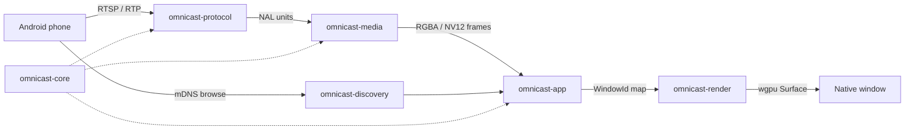

# omnicast-rs

[](LICENSE)
[](https://www.rust-lang.org/)
[](ROADMAP.md)

**omnicast-rs** is a high-performance, open-source Android screen-casting **desktop receiver** written in Rust. It advertises itself on the local network, accepts streaming sessions, decodes H.264, and renders each phone into its own native, resizable GPU-backed window.

> Milestone 1 (`v0.1.0-alpha`): end-to-end single-device pipeline shell with multi-window `winit` + `wgpu` rendering and a 60 FPS synthetic frame demo.

## Architecture



| Crate | Role |
|-------|------|
| `omnicast-core` | Session state, device IDs, cross-crate message types |
| `omnicast-discovery` | mDNS advertisement (`_display._tcp` / `_googlecast._tcp`) |
| `omnicast-protocol` | Async RTSP server + RTP / H.264 NAL extraction |
| `omnicast-media` | Decode pipeline (H.264 → raw frames; mock path in alpha) |
| `omnicast-render` | `wgpu` shaders, textures, fullscreen blit |
| `omnicast-app` | `winit` `ApplicationHandler`, `WindowId` → `DeviceContext` |

## Features (alpha)

- Native multi-window receiver shell (`winit` ApplicationHandler)
- Hardware-accelerated presentation via `wgpu`
- mDNS receiver advertisement on LAN
- Tokio-based RTSP listener and RTP H.264 NAL parser
- Synthetic 60 FPS frame generator for pipeline verification
- View-only (no reverse input) for v0.1

## Quick start

### Prerequisites

- Rust **1.75+** (stable)
- Windows 10/11 (primary MVP target), GPU drivers for `wgpu`
- Same Wi-Fi LAN as the Android device (for real discovery later)

### Build & run (live phone — Milestone 1 / Mobile 1)

```bash
cargo build -p omnicast-app
cargo run -p omnicast-app
```

This advertises **OmniCast** via mDNS (`_rtsp._tcp`, `_display._tcp`, `_googlecast._tcp`) and accepts RTSP on TCP **8554**. When your phone connects, the terminal logs every request/response plus session parameters (peer IP/port, Transport, codec).

Allow **UDP 5353**, **TCP 8554**, and **UDP 5004** through Windows Firewall. Stay on the same Wi‑Fi LAN (not guest/AP isolation).

### Demo (synthetic frames)

```bash
cargo run -p omnicast-app -- --demo
cargo run -p omnicast-app -- --demo --devices 2
cargo run -p omnicast-app -- --no-discovery
```

### Checks

```bash
cargo fmt --all -- --check
cargo clippy --workspace --all-targets
cargo check --workspace
```

## Protocol notes

| Stack | Status in v0.1.0-alpha |
|-------|------------------------|
| mDNS display / Cast / RTSP service records as **OmniCast** | Actively advertised |
| Live RTSP handshake + packet/session logging | Implemented (Mobile 1) |
| RTP depacketization (H.264 NAL extract) | Implemented |
| Full Google Cast / Miracast OEM interoperability | Not yet — see [ROADMAP.md](ROADMAP.md) |
| Production HW decoder backends | Stub / mock frames; real decode tracked for Phase 2 |

Advertising Cast-oriented DNS-SD records does **not** by itself complete a phone cast session. Control-plane and media negotiation continue in later milestones.

## Project layout

```
crates/
  omnicast-core/
  omnicast-discovery/
  omnicast-protocol/
  omnicast-media/
  omnicast-render/
  omnicast-app/
```

## License

[MIT](LICENSE)
